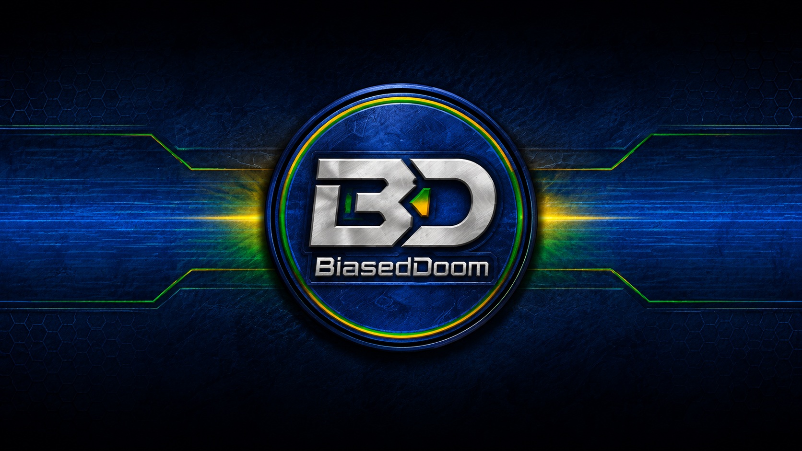

# BiasedDoom



[](https://github.com/ericsonwillians/BiasedDoom/actions/workflows/continuous_integration.yml)

BiasedDoom is a modern GZDoom-derived engine focused on next-generation modding while keeping classic DOOM compatibility intact. It adds native glTF 2.0 loading, skeletal animation, PBR-friendly materials, richer lighting and post-processing controls, a heavily expanded third-person camera, deterministic procedural missions, and resilient player/HUD customization.

The executable produced by the build is `biaseddoom`.

> [!IMPORTANT]
> This project uses AI-assisted development. Contributions are judged by functionality, maintainability, and reviewability, not by whether a tool helped write the first draft.

Special thanks to Coraline of the EDGE team for allowing this README to originally use the EDGE README as a template.

## What BiasedDoom Adds

BiasedDoom keeps GZDoom's WAD/PK3, DECORATE, ZScript, ACS, MD2, MD3, voxel, and classic renderer compatibility, then layers modern asset and presentation features on top.

| Area | Highlights |
|------|------------|
| glTF models | Native `.gltf` and `.glb` loading through `fastgltf` |
| Animation | Skeletal animation, bone weights, animation blending, and GPU skinning paths |
| Materials | PBR-oriented metallic-roughness workflow for modern model assets |
| Rendering | OpenGL, Vulkan, GLES2, and software renderer support inherited from GZDoom |
| Lighting | Dynamic light shaping, falloff controls, shadows, GI-style ambient, specular/emissive tuning |
| Post-processing | Graphics presets, atmosphere/fog, bloom, tonemapping, color grading, CRT/VHS/NTSC, SSAO, FXAA |
| Camera | Menu-driven third-person camera with presets, shoulder offsets, collision padding, pitch modes, and projected crosshair |
| Procedural levels | Deterministic mission graphs, five architectural themes, hierarchical Doom-style spaces, macro liquids, staged keys, reachable landmarks, and map sizes from 1 to 80 |
| Player customization | Mod-resistant player skins plus independently configurable horizontal and vertical autoaim |
| HUD customization | Runtime mugshot scale and position controls for stock ZScript and legacy SBARINFO status bars |
| Scripting | Opt-in embedded CPython alongside unchanged ACS and ZScript support |
| Workflow | Blender-friendly export path using standard glTF 2.0 assets |

## Feature Highlights

### Native glTF 2.0

BiasedDoom loads `.gltf` and `.glb` files directly, so mod authors can move from Blender or other DCC tools into the engine without converting to older model formats. The implementation is centered in `src/common/models/model_gltf.*` and uses `fastgltf`.

Supported goals include:

- Binary `.glb` and text `.gltf` model loading.
- Skeletal meshes with armatures, bone weights, and animation tracks.
- PBR material data compatible with metallic-roughness authoring.
- Integration with existing actor/model definition workflows.
- Compatibility with classic model formats where mods still use them.

Start with:

- [docs/README.md](docs/README.md)
- [docs/gltf/quick-start.md](docs/gltf/quick-start.md)
- [docs/gltf/player-replacement-workflow.md](docs/gltf/player-replacement-workflow.md)
- [docs/gltf/blender-authoring.md](docs/gltf/blender-authoring.md)

### Lighting And Materials

BiasedDoom exposes a large lighting stack from the in-game menus:

`Options -> Display Options -> Advanced -> Lighting`

Important controls include:

- Lighting style presets: Custom, Classic Balanced, Modern Pretty, Warm Cinematic, Horror Contrast, Neon Glow, PBR Showcase, Bright Playable, Soft Natural, Crisp Tactical, Low Light Realism, Hellfire Glow, and Void Dread.
- Sector light mode and fog mode controls.
- Dynamic lights for sprites and particles.
- Dynamic light falloff models: Linear, Inverse-square, and Power.
- Dynamic light intensity, saturation, range scale, falloff softness, and exponent.
- Light wrap and indirect bounce controls for softer, more modern illumination.
- Light temperature, ambient floor, specular boost, and emissive boost sliders.
- GI Ambient and GI Ambient Strength for broader scene fill.
- Sprite Lighting Refine for more polished actor/sprite lighting.
- Shadow maps, shadow quality, shadow filtering, and dynamic shadow strength.
- Weapon light strength and enhanced night vision options.

The same lighting/material controls are also surfaced inside the post-process lighting submenu:

`Options -> Display Options -> Advanced -> Postprocess -> Lighting / Materials`

### Post-Processing

Post-processing is organized as a set of practical submenus:

`Options -> Display Options -> Advanced -> Postprocess`

The top-level menu includes a Graphics Preset selector, a Preset Locked toggle, PostFX enable, and PostFX Quality. The detailed submenus are:

| Menu | What It Controls |
|------|------------------|
| Atmosphere / Fog | Atmospheric palettes, fog mode, fog color, density, scale, sky fog, wall fog, fog gradients, and fog direction |
| Image Effects | Bloom, lens effects, vignette, chromatic aberration, film grain, sharpening, and retro pixelation |
| Color / Tonemap | Tonemap mode, palette tonemapping, color grading, color grade strength, and LUT selection |
| Lighting / Materials | The lighting/material controls listed above |
| Retro Display | VHS effects, CRT mask/scanline modes, and NTSC simulation |
| Output / Performance | PostFX quality, SSAO, SSAO portal handling, FXAA, and dithering |

Tonemapping includes classic and cinematic options such as Uncharted2, Hejl-Dawson, Reinhard, Palette, Gothic, Gothic Noir, Moonlit, Candlelit, Graveyard, Silent Hill, Bleach Bypass, Lottes Filmic, and ACES.

Atmosphere modes include Gothic, Blood, Sepia, Toxic, Hellfire, Cyberpunk, Fogbound, Bleak Blue, Otherworld, and Sodium Vapor.

Retro display options include VHS, CRT Standard Scanlines, Aperture Grille, Shadow Mask, and NTSC.

### Third-Person Camera

The third-person camera is now a first-class menu feature rather than a console-only chasecam toggle:

`Options -> Display Options -> Appearance -> Third-person camera`

Controls include:

- Third-person view toggle (`chase_enabled`), archived in user config.
- Death camera toggle.
- Camera preset selector.
- Draw player body toggle.
- Camera distance.
- Vertical offset.
- Shoulder offset.
- Look-at height.
- Pitch response: Follow aim, Stay level, or Soft follow.
- Collision padding.

Available camera presets:

| Preset | Intent |
|--------|--------|
| Classic | Original-style chasecam distance and height |
| Modern follow | Centered, readable follow camera |
| Action shoulder | Right-shoulder combat framing |
| Survival horror | Wider, slightly offset exploratory view |
| Horror shoulder | Tight horror/action shoulder framing |
| Tight follow | Compact centered camera |
| Arena wide | Wider view for faster combat spaces |
| Shoulder close right | Close right shoulder |
| Shoulder close left | Close left shoulder |
| Tactical right | Wider right shoulder |
| Tactical left | Wider left shoulder |
| Cinematic high | High, pulled-back cinematic view |
| Low dramatic | Low, close dramatic view |

Gameplay-facing fixes and details:

- Third-person state persists through config via `chase_enabled`.
- Weapon sprites are suppressed whenever third-person is active, including immediately after restarting with third-person enabled.
- Crosshair placement is projected from the player's actual aim trace, not blindly drawn at screen center.
- Camera clipping uses configurable collision padding so tight spaces are less jarring.
- The `chase` console command and existing `CF_CHASECAM` behavior remain compatible.

### Procedural Missions

Choose `Procedural Game` from the Doom main menu to build a deterministic UDMF mission without an external map WAD. The setup menu exposes the seed; Techbase, Hell, Industrial, Gothic, and Corrupted Tech themes; generation difficulty; map size from 1 (compact) through 80 (absurd); layout shape; verticality; architectural detail; and outdoor-space cadence.

The generator builds progression before geometry: staged keys and doors, safe same-stage loops, secrets, weapon milestones, hubs, arenas, and a distinct finale. Its room compositor deliberately mixes narrow connectors, small chambers, medium combat rooms, and major compound halls with L-, T-, cross-, stepped, axial, and asymmetric silhouettes. Longer foldback loops and raised windows preview or revisit nearby areas without bypassing progression.

Theme-aware water, blood, nukage, and lava are macro-layout features rather than decorative puddles. A mission can contain a flooded room with a dry island, irregular reservoirs, trenches, paired basins, or straight, staggered, and bending multi-cell watercourses crossed by dry causeways. Reveals vary among pavilions, framed wall alcoves, and false-wall chambers; elevated ranged positions vary among stair platforms, turrets, and wall-backed balconies. All variation remains deterministic for a given recipe and uses IWAD-safe assets.

See the [player and mod-author guide](docs/engine/procedural-map-generation.md) and the [implementation and evaluation paper](docs/engine/procedural-generation-research-paper.md).

### Player, Autoaim, And Mugshot Customization

Player skins now remain active in gameplay and third-person views even when a gameplay mod replaces the player class or suppresses the usual Player Setup selector. Autoaim can be disabled completely or configured independently on the horizontal and vertical axes.

Status-bar portraits can be scaled from 0.25x to 4x and moved horizontally or vertically from `Options -> HUD Options -> Mugshot options`. The transform applies to both the stock Doom ZScript status bar and legacy SBARINFO `drawmugshot` commands, while mod authors can still define an explicit target width and height.

See [Mugshot customization](docs/engine/mugshot-tutorial.md) for player controls and mod-author syntax.

### Backward Compatibility

BiasedDoom is still a DOOM-family engine:

- IWAD loading and mod loading work through standard command-line paths.
- Existing GZDoom-style WAD/PK3 mods remain the baseline compatibility target.
- Classic model formats are still supported.
- DECORATE, ZScript, ACS, and existing renderer choices remain available.

### Python, ACS, And ZScript

BiasedDoom adds an embedded CPython 3.10+ runtime as a third scripting path.
It does not replace or redirect legacy ACS or ZScript. Hybrid PK3s can contain
all three. Python API v2 provides synchronous pre/tick/post callbacks, live
actor/player/sector/line handles, native gameplay mutations and attacks,
whole-tic performance budgets, ACS execution, and typed public ZScript actor
method calls.

Python mods are arbitrary trusted code, not a sandboxed content format. They
are discovered through a root `PYTHON` manifest but do not execute unless the
player passes `-python` or has deliberately archived `py_enabled=true`.
`-nopython` always forces the runtime off.

Build every focused example, then run one:

```bash
./tools/build-python-examples.sh
./build/biaseddoom -iwad /path/to/DOOM2.WAD \
    -file ./build/python-examples/02_live_actor_handles.pk3 -python -stdout
```

The [complete Python tutorial and API reference](docs/scripting/python.md)
covers manifests, real-time handles and events, mutation and scheduling,
performance containment, JSON save state, ACS/ZScript interoperability,
security, packaging, diagnostics, and automated testing. The
[example suite](examples/python/) contains twelve small capability-focused mods
plus the exhaustive hybrid integration fixture.

## Quick Start

### Download A Release

For players who do not want to compile the engine, use the GitHub Releases page:

- Linux: download `BiasedDoom-<version>-Linux-x86_64.AppImage`, make it executable, and run it.
- Windows: download `BiasedDoom-<version>-Windows-x64.zip`, extract it, and run `biaseddoom.exe`.
- Windows MinGW: download `BiasedDoom-<version>-Windows-x64-MinGW.zip` if you want the Linux-built cross-compiled package. This variant keeps ACS/ZScript but cannot embed Python; use the native Windows package for Python mods.
- macOS 10.15 or newer: download `BiasedDoom-<version>-macOS.tar.gz`, extract it, and launch the application.

You still need a supported IWAD such as `DOOM2.WAD`. BiasedDoom searches
installed Steam libraries and standard platform locations automatically; run
`biaseddoom -findiwads` to print everything it detects.

### Linux / macOS

```bash
git clone https://github.com/ericsonwillians/BiasedDoom.git
cd BiasedDoom
./build.sh --release --clean
./build/biaseddoom -findiwads
./build/biaseddoom -iwad doom2
```

To install after building:

```bash
./build.sh --release --clean --install
```

By default, installation targets `~/.local` unless you pass `--install-prefix`.

### Windows

1. Install Visual Studio 2022 with the Desktop development with C++ workload.
2. Install Git for Windows.
3. Install CMake for Windows.
4. Open PowerShell in the repository checkout.
5. Build and optionally package:

```powershell
powershell -ExecutionPolicy Bypass -File tools\build-windows.ps1 -Configuration Release
powershell -ExecutionPolicy Bypass -File tools\build-windows.ps1 -Configuration Release -Package
```

The `-Package` command creates `artifacts\BiasedDoom-Windows-x64-Release.zip`, suitable for sharing with users. The helper statically embeds OpenAL Soft and libsndfile's OGG/FLAC/Opus/MPEG codecs by default, so the package does not depend on separately copied `openal32.dll` or `sndfile.dll` files. Use `-NoOpenALVcpkg` or `-NoLibSndFileVcpkg` only for development builds that intentionally provide those libraries another way.

Manual CMake build (the audio options keep the result self-contained):

```cmd
cmake -B build-windows -S . -G "Visual Studio 17 2022" -A x64 -DCMAKE_TOOLCHAIN_FILE=vcpkg\scripts\buildsystems\vcpkg.cmake -DOPENAL_SOFT_VCPKG=ON -DDYN_OPENAL=OFF -DVCPKG_LIBSNDFILE=ON -DDYN_SNDFILE=OFF
cmake --build build-windows --config Release
```

The executable will be under the build output directory, with platform/configuration layout depending on the generator.

### Linux-Hosted Windows Build

On Debian/Ubuntu, install MinGW-w64 alongside the normal Linux build dependencies:

```bash
sudo apt install mingw-w64 g++-mingw-w64 gcc-mingw-w64 nasm
```

Then build and package a Windows x64 `.exe` from Linux:

```bash
./tools/build-windows-mingw.sh --clean --package
```

The package is written to `artifacts/BiasedDoom-<version>-Windows-x64-MinGW.zip` and contains `biaseddoom.exe`, PK3 resources, soundfonts, FM banks, and a dependency report. OpenAL Soft and libsndfile's compressed-audio codecs are statically embedded by default; `--no-openal-vcpkg` and `--no-libsndfile-vcpkg` opt out for development builds. MinGW's selected vcpkg CPython port is unsupported, so this package compiles Python stubs while retaining ACS and ZScript.

The helper validates vcpkg's MinGW `libvpx.a` before linking. If vcpkg produced a Linux ELF archive instead of a Windows COFF archive, the script rebuilds libvpx with `x86_64-w64-mingw32-` tools and keeps VP8/VP9 movie support enabled. It also rejects stale vcpkg archives built with MinGW's incompatible Win32 thread runtime and automatically rebuilds them with the POSIX runtime. When Wine is installed, the helper runs the Windows OpenAL/OGG/FLAC regression probe automatically.

To smoke-test the package under Wine, extract it beside a supported IWAD and keep `-stdout` enabled so startup errors appear in the terminal:

```bash
wine biaseddoom.exe -stdout -iwad doom2.wad +quit
```

On Windows, capture a complete startup, OpenAL device, and codec report with `biaseddoom.exe -stdout -audiodiagnostics -norun`. The process exits after initialization and writes `%LOCALAPPDATA%\biaseddoom\biaseddoom-audio.log`, even when audio succeeds. If AppData cannot be written, it falls back to `biaseddoom-audio.log` beside the executable. During normal play, `snd_status` repeats the backend and decoder report and `snd_listdrivers` lists audio endpoints. BiasedDoom automatically reopens a disconnected endpoint without discarding playback state and retries initialization when Windows temporarily has no usable output. See the [audio troubleshooting guide](docs/audio-troubleshooting.md).

The `-norun` diagnostic path intentionally pauses before closing in Windows GUI builds. If you use it under Wine, pipe a keypress or expect shell exit code `57`, which is the Windows `1337` diagnostic exit code truncated to 8 bits.

## Running The Game

You need an IWAD file from a supported game:

| Game | IWAD |
|------|------|
| DOOM shareware | `DOOM1.WAD` |
| DOOM | `DOOM.WAD` |
| DOOM II | `DOOM2.WAD` |
| Final DOOM | `TNT.WAD`, `PLUTONIA.WAD` |
| Heretic | `HERETIC.WAD` |
| Hexen | `HEXEN.WAD` |
| Strife | `STRIFE1.WAD` |

Examples:

```bash
./build/biaseddoom -findiwads
./build/biaseddoom -iwad doom2
./build/biaseddoom -iwad ~/games/doom/DOOM2.WAD
./build/biaseddoom -iwad ~/games/doom/DOOM2.WAD -file ~/mods/example.pk3
```

Normal startup also opens the picker when multiple games are discovered.
Modern and legacy Steam libraries, including Linux
`~/.steam/debian-installation`, external libraries, Flatpak/Snap layouts,
macOS Steam, and Windows registry/Program Files installs are supported. See
[IWAD discovery](docs/engine/iwad-discovery.md) for search order, environment
variables, custom recursive paths, and troubleshooting.

## Build System

BiasedDoom uses CMake and vcpkg manifest mode. The helper script `build.sh` performs dependency checks, repairs common setup problems, bootstraps vcpkg, configures, builds, optionally installs, and can run a smoke check.

### Required Tools

| Tool | Minimum | Notes |
|------|---------|-------|
| CMake | 3.16 | Required by the root build |
| C++ compiler | GCC 9+, Clang 11+, or MSVC 2022 | C++17 required |
| Git | Any modern version | Required for checkout and vcpkg |
| Ninja or Make | Any modern version | Ninja is preferred |
| vcpkg | Bootstrapped by `build.sh` | Manifest feature `gltf-support` pulls `fastgltf` |

### Linux Dependencies

On Debian/Ubuntu:

```bash
sudo apt update
sudo apt install --no-install-recommends -y \
    build-essential cmake git ninja-build pkg-config \
    libsdl2-dev libglib2.0-dev libgtk-3-dev libvpx-dev libwebp-dev python3-dev
```

On Fedora:

```bash
sudo dnf install -y \
    gcc-c++ cmake git ninja-build pkgconf-pkg-config \
    SDL2-devel glib2-devel gtk3-devel libvpx-devel libwebp-devel python3-devel
```

On Arch:

```bash
sudo pacman -Syu --needed \
    base-devel cmake git ninja pkgconf sdl2 glib2 gtk3 libvpx libwebp python
```

On openSUSE:

```bash
sudo zypper refresh
sudo zypper install -t pattern devel_C_C++
sudo zypper install cmake git ninja pkg-config libSDL2-devel glib2-devel gtk3-devel libvpx-devel libwebp-devel python3-devel
```

`build.sh --auto-install-deps` can print and optionally run the matching commands for your Linux distribution.

For Linux-hosted Windows `.exe` builds, also install MinGW-w64:

```bash
sudo apt install mingw-w64 g++-mingw-w64 gcc-mingw-w64 nasm
```

### macOS Dependencies

```bash
xcode-select --install
brew install cmake ninja sdl2 libvpx webp moltenvk vulkan-volk
```

### Build Helper Options

| Option | Description |
|--------|-------------|
| `--clean` | Remove the build directory before configuring |
| `--release` | Build type `Release` |
| `--debug` | Build type `Debug` |
| `--relwithdebinfo` | Build type `RelWithDebInfo` |
| `--jobs N` | Number of parallel compile jobs |
| `--generator NAME` | CMake generator override |
| `--no-gltf` | Disable glTF support |
| `--no-vulkan` | Disable Vulkan |
| `--openal-vcpkg` | Use vcpkg OpenAL Soft |
| `--install` | Install after successful build |
| `--install-prefix PATH` | Install into a custom prefix |
| `--configure-only` | Configure but do not compile |
| `--build-only` | Skip configure and compile existing build tree |
| `--check` | Run dependency/repo checks only |
| `--deps-only` | Check and optionally install dependencies only |
| `--repair` | Install missing dependencies automatically and continue |
| `--run` | Run the binary for a basic smoke check |
| `--auto-install-deps` | Prompt-guided dependency installation |
| `--yes` | Non-interactive yes to prompts |
| `--verbose` | Verbose command output |
| `--dry-run` | Print commands without executing |

Environment variables supported by the script include `BUILD_TYPE`, `CLEAN_BUILD`, `NUM_JOBS`, `GENERATOR`, `VERBOSE`, `AUTO_INSTALL_DEPS`, and `INSTALL_PREFIX`.

Examples:

```bash
./build.sh --check
./build.sh --deps-only --auto-install-deps
./build.sh --release --clean
./build.sh --release --clean --install
./build.sh --build-only
BUILD_TYPE=RelWithDebInfo NUM_JOBS=8 ./build.sh
```

On Windows, use the PowerShell helper:

```powershell
powershell -ExecutionPolicy Bypass -File tools\build-windows.ps1 -Configuration Release -Clean
powershell -ExecutionPolicy Bypass -File tools\build-windows.ps1 -Configuration Release -Package
```

On Linux, use the MinGW-w64 helper to cross-compile and package `biaseddoom.exe`:

```bash
./tools/build-windows-mingw.sh --clean --package
```

The helper verifies the vcpkg MinGW libvpx archive and automatically repairs it if the archive was built with host Linux objects.

After extracting the zip with an IWAD, this Wine smoke test should initialize and exit cleanly:

```bash
wine biaseddoom.exe -stdout -iwad doom2.wad +quit
```

### Manual CMake Build

```bash
cmake -B build -S . \
    -DCMAKE_BUILD_TYPE=Release \
    -DCMAKE_TOOLCHAIN_FILE=vcpkg/scripts/buildsystems/vcpkg.cmake \
    -DBIASEDDOOM_ENABLE_GLTF=ON \
    -DBIASEDDOOM_BUILD_GLTF=ON \
    -DHAVE_VULKAN=ON

cmake --build build --config Release --parallel
```

Important CMake options:

| Option | Default | Description |
|--------|---------|-------------|
| `BIASEDDOOM_ENABLE_GLTF` | `ON` | Enable glTF 2.0 model support |
| `BIASEDDOOM_BUILD_GLTF` | `ON` | Build the glTF implementation |
| `BIASEDDOOM_ENABLE_PYTHON` | `ON` | Build embedded Python when CPython 3.10+ development files exist |
| `BIASEDDOOM_REQUIRE_PYTHON` | `OFF` | Fail configuration instead of compiling Python stubs |
| `BIASEDDOOM_BUILD_AUDIO_TESTS` | `OFF` | Build the standalone OpenAL/OGG/FLAC regression probe (enabled by Windows build and CI helpers) |
| `HAVE_VULKAN` | `ON` | Enable Vulkan support |
| `HAVE_GLES2` | `ON` on Linux/Windows | Enable GLES2 support |
| `NO_OPENAL` | `OFF` | Disable OpenAL |
| `DYN_OPENAL` | `ON` | Load OpenAL dynamically |
| `OPENAL_SOFT_VCPKG` | `OFF` | Use vcpkg OpenAL Soft |
| `VCPKG_LIBSNDFILE` | `OFF` | Use vcpkg libsndfile with OGG/FLAC/Opus/MPEG support |
| `LIBVPX_VCPKG` | `OFF` | Use vcpkg libvpx |
| `WITH_ASAN` | `OFF` | Address Sanitizer |
| `WITH_UBSAN` | `OFF` | Undefined Behavior Sanitizer |

## Blender To BiasedDoom Workflow

1. Model and rig in Blender.
2. Apply transforms before export.
3. Export as glTF 2.0. Use `.gltf + .bin + external textures` for textured assets; `.glb` is fine for self-contained geometry/animation tests or models that do not need embedded image textures.
4. Include materials and animations in the export.
5. Put model assets in your mod package.
6. Define the actor/model data using the BiasedDoom/GZDoom model workflow and, where needed, the glTF ZScript helpers.

Useful references:

- [docs/gltf/quick-start.md](docs/gltf/quick-start.md)
- [docs/gltf/player-replacement-workflow.md](docs/gltf/player-replacement-workflow.md)
- [docs/gltf/production-workflow-guide.md](docs/gltf/production-workflow-guide.md)
- [docs/gltf/zscript-usage.md](docs/gltf/zscript-usage.md)
- [docs/gltf/zscript-api.md](docs/gltf/zscript-api.md)
- [docs/gltf/blender-authoring.md](docs/gltf/blender-authoring.md)

## Repository Map

| Path | Purpose |
|------|---------|
| `src/common/models/` | Model loaders, including glTF support |
| `src/common/rendering/` | OpenGL, GLES, Vulkan, post-processing, renderer support code |
| `src/rendering/` | Game renderer integration and view setup |
| `src/playsim/` | Actor simulation, line traces, camera offset clipping, ZScript bindings |
| `src/python/` | Embedded CPython runtime, VFS API, callbacks, actor bridge, and save state |
| `src/common/textures/` | Texture and PBR material support |
| `wadsrc/static/menudef.txt` | In-game menu definitions, including camera/rendering controls |
| `wadsrc/` and related `wadsrc_*` dirs | Built into PK3 resources |
| `libraries/` | Bundled supporting libraries |
| `.github/workflows/` | CI and release automation |

## Documentation

- [TROUBLESHOOTING.md](TROUBLESHOOTING.md) - startup, IWAD, audio, mod, Python, and build problem diagnosis.
- [docs/README.md](docs/README.md) - documentation index and recommended reading paths.
- [docs/gltf/README.md](docs/gltf/README.md) - glTF modding, Blender, MODELDEF, and ZScript.
- [docs/development/README.md](docs/development/README.md) - implementation notes and diagnostics.
- [docs/engine/README.md](docs/engine/README.md) - non-glTF engine feature guides.
- [docs/engine/procedural-map-generation.md](docs/engine/procedural-map-generation.md) - procedural-game controls, architecture, and tests.
- [docs/engine/procedural-generation-research-paper.md](docs/engine/procedural-generation-research-paper.md) - generator design and evaluation.
- [docs/engine/mugshot-tutorial.md](docs/engine/mugshot-tutorial.md) - mugshot controls and SBARINFO authoring.
- [docs/scripting/python.md](docs/scripting/python.md) - complete embedded Python tutorial, API, security, and test guide.
- [docs/release/README.md](docs/release/README.md) - release process and artifacts.
- [SECURITY.md](SECURITY.md) - vulnerability reporting.
- [CHANGELOG.md](CHANGELOG.md) - release history.

## CI And Releases

Continuous Integration builds Windows, macOS, and Linux configurations from `.github/workflows/continuous_integration.yml`.

Release packaging is handled by `.github/workflows/release.yml` and produces a Linux AppImage, a native Windows x64 zip containing `biaseddoom.exe`, a Linux-built Windows x64 MinGW zip, a macOS package, and SHA256 checksum files. Use the release tooling in `tools/release.sh` when preparing tagged releases.

Common release flow:

```bash
./tools/release.sh --patch
./tools/release.sh --patch --draft
./tools/release.sh --set 4.15.7 --prerelease
```

See [docs/release/releasing.md](docs/release/releasing.md) for the full maintainer checklist.

## Branding Notes

The project is named BiasedDoom, but several historical source filenames still contain `zdoom` or `gzdoom`. Those names are inherited from the upstream codebase and are not automatically user-facing.

Visible branding usually lives in:

- `src/version.h` for `GAMENAME`, `WGAMENAME`, `GAMENAMELOWERCASE`, `APPID`, and version strings.
- `wadsrc/static/widgets/banner.png` for the launcher banner.
- `src/win32/zdoom.rc` for Windows executable metadata.
- `src/posix/osx/zdoom-info.plist` and `src/posix/osx/zdoom.icns` for macOS bundle metadata and icon.
- `src/posix/freedesktop/org.drdteam.biaseddoom.*` for Linux desktop metadata.

Keep `#define GZDOOM 1` in `src/version.h` unless you are intentionally breaking compatibility assumptions.

## Contributing

Pull requests and issues are welcome. For code changes:

- Follow the style already used in the touched subsystem.
- Prefer `TArray`, `FString`, and existing engine helpers over unrelated STL rewrites.
- Keep changes scoped and testable.
- Use `#pragma once` for new headers unless local style requires otherwise.
- Run at least a local build for code changes.

For docs-only changes, run:

```bash
git diff --check
```

For code changes, a good local gate is:

```bash
cmake --build build --target zdoom -- -j$(nproc)
cmake --build build --target biaseddoom_pk3 -- -j$(nproc)
```

## License

BiasedDoom is licensed under the GNU General Public License v3 or later. Original GZDoom portions retain their respective BSD-style source headers where applicable.

See [LICENSE](LICENSE) and [docs/licenses/README.TXT](docs/licenses/README.TXT).
